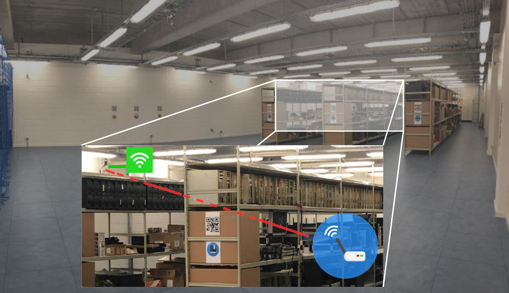
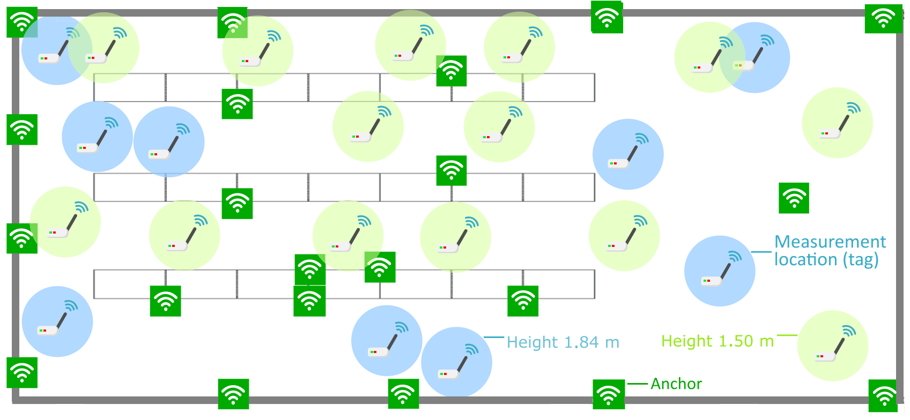

# Industrial-UWB-localization-CIR-dataset
Industrial UWB localization dataset containing Channel Impulse Response data (CIRs).

## Dataset description
This dataset contains CIRs from 23 different positions in an industrial environment, as illustrated in the picture below.

These originate from a tag-anchor pair configured with two-way-ranging for distance estimations. In total, 21 anchors are placed in the area, allowing both Line-of-Sight (LOS) and Non-LOS (NLOS) signal propagation, as illustrated below.

Further details on this dataset can be found in [1], where it was used extensivly for ranging error estimation using machine learning techniques.

Please always refer to our publication [1] and [2] when using our dataset.

[The dataset can be downloaded here.](https://cloud.ilabt.imec.be/index.php/s/PMMTNTPotZJpMEn) 

## References
[1] Fontaine, J., Ridolfi, M., Van Herbruggen, B., Shahid, A., & De Poorter, E. (2020). Edge inference for UWB ranging error correction using autoencoders. IEEE Access, 8, 139143-139155.

[2] Van Herbruggen, B., Jooris, B., Rossey, J., Ridolfi, M., Macoir, N., Van den Brande, Q., ... & De Poorter, E. (2019). Wi-PoS: A low-cost, open source ultra-wideband (UWB) hardware platform with long range sub-GHz backbone. Sensors, 19(7), 1548.

Contact
If you need any further details about the dataset, then you can contact jaron.fontaine@ugent.be or ben.vanherbruggen@UGent.be.
